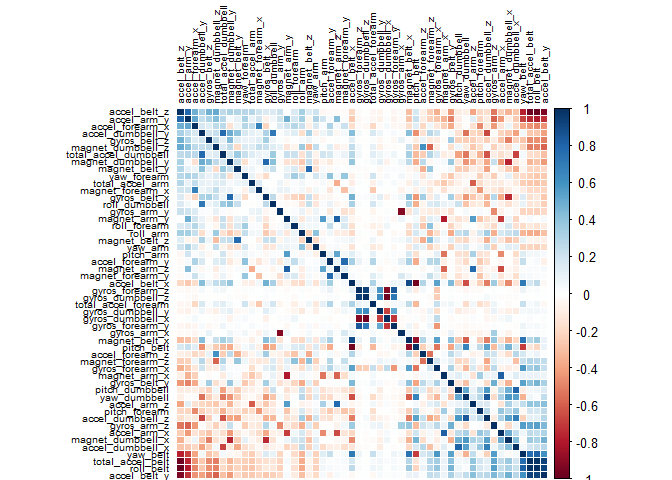

# Machine learning course project
askrusyos  


### Introduction
The goal of this document is to describe the prediction process of a set of data about physical activity. Modern devices are capable of acquiring lot of information about body movement and can be used to classify how well (or not well) an exercise is performed. Starting from a set of nearly 20,000 observations, we will try to build an algorithm to predict the performance of an individual.

The *classe* variable is the characteristic we want to predict, using the predictors that come along with the data. Since the sample size is not small we can afford to do cross validation, after importing and cleaning the data.
  
### Data cleaning and exploration

The instructions below require that the necessary datasets have already been downloaded and put in the working directory.


```r
# loading requested libraries
library(caret)
library(randomForest)
library(corrplot)
```


```r
# importing data
training <- read.csv("pml-training.csv", na.strings = c("NA", "", "#DIV/0!"))
testing <- read.csv("pml-testing.csv", na.strings = c("NA", "", "#DIV/0!"))
```

There are many columns with NA values in them and they will be removed from the analysis. Much of these columns have lots of NAs in them so the loss of information should not be excessive.
We also get rid of the first seven columns, since they are additional information on the dataset and not predictors.


```r
# cleaning data
training <- training[, -c(1:7)]
testing <- testing[,-c(1:7)]
training <- training[, colSums(is.na(training)) == 0]
testing <- testing[, colSums(is.na(testing)) == 0]
dim(training)
```

```
## [1] 19622    53
```

```r
dim(testing)
```

```
## [1] 20 53
```
We can see that, after the cleaning data steps above, the number of variable has been reduced to 53.  
W can see their correlation in the following plot:

```r
# importing data
correlation_matrix <- cor(training[, -53])
corrplot(correlation_matrix, order = "FPC", method = "color",tl.cex = 0.6, tl.col = rgb(0, 0, 0))
```

 


As said above we will use cross-validation; the number of selected folds will be 6


```r
# creating training and validation sets
traincontrol <- trainControl(method = "cv", number = 6)
```


### Predictions

We are now ready to try our first prediction method. We will compare a simple decision tree and a random forest method. Both are important methods in machine learning literature and are able to predict a qualitative outcome, like the one we are analyzing now.  


```r
# decision tree prediction
modelTree <- train(classe ~ ., data=training, method = "rpart", trControl = traincontrol)
modelTree
```

```
## CART 
## 
## 19622 samples
##    52 predictor
##     5 classes: 'A', 'B', 'C', 'D', 'E' 
## 
## No pre-processing
## Resampling: Cross-Validated (6 fold) 
## Summary of sample sizes: 16350, 16352, 16351, 16352, 16353, 16352, ... 
## Resampling results across tuning parameters:
## 
##   cp          Accuracy   Kappa      Accuracy SD  Kappa SD  
##   0.03567868  0.5059597  0.3548230  0.01688321   0.02245961
##   0.05998671  0.4499184  0.2654796  0.06602277   0.11072545
##   0.11515454  0.3238629  0.0601771  0.04322820   0.06597441
## 
## Accuracy was used to select the optimal model using  the largest value.
## The final value used for the model was cp = 0.03567868.
```


```r
# random forest prediction with cross-validation
modelForest <- train(y = training$classe, x = training[,-53], data=training, method = "rf", trControl = traincontrol, ntree= 500)
modelForest
```

```
## Random Forest 
## 
## 19622 samples
##    52 predictor
##     5 classes: 'A', 'B', 'C', 'D', 'E' 
## 
## No pre-processing
## Resampling: Cross-Validated (6 fold) 
## Summary of sample sizes: 16351, 16352, 16352, 16350, 16352, 16353, ... 
## Resampling results across tuning parameters:
## 
##   mtry  Accuracy   Kappa      Accuracy SD  Kappa SD   
##    2    0.9949038  0.9935535  0.001518561  0.001921135
##   27    0.9942414  0.9927155  0.001712084  0.002165865
##   52    0.9887883  0.9858163  0.003110480  0.003936290
## 
## Accuracy was used to select the optimal model using  the largest value.
## The final value used for the model was mtry = 2.
```


## Conclusions

We see that the accuracy value for the decision tree method is low (0.507), while the one of the random forest method is much higher: 0.993. The out-of-sample error is complementary to 1 of this number, so it's 0.007 or 0.7%, which is small. So in this case the choice is obvious:  the random forest alghoritm has shown has a good predictive power, at least on the training set (there may be a risk of overfitting dealing with the test set).

The last passage is for doing predictions on the observations of the test set:

```r
# test set predictions
predicttest<-predict(modelForest, testing)
predicttest
```

```
##  [1] B A B A A E D B A A B C B A E E A B B B
## Levels: A B C D E
```

